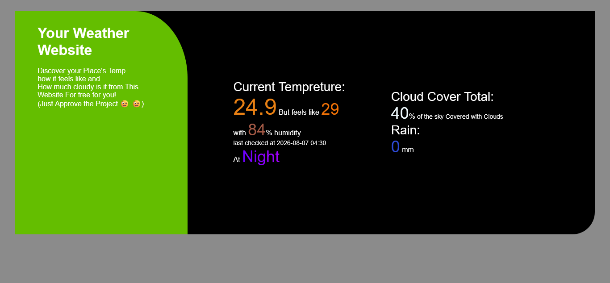

# Weather App

## Technology used

this is made using html,css,javascript only

i also used 2 apis

the ipinfo api that gives me the longtitude and the latitude of the device from the ip adress of the device

from this link

http://ipinfo.io/json

i used these coordinates for the other api from open meteo to get data about the weather in the area

from this link

https://api.open-meteo.com/v1/forecast?latitude=latitude&longitude=longtitude&current=temperature_2m,apparent_temperature,is_day,cloud_cover,rain,relative_humidity_2m&timezone=auto&forecast_days=1

replace latitude and longtitude with your actual latitude and longtitue to work

## Features

### this website displays

- current temperature
- apparent temperature
- relative humidity
- cloud coverage
- rain

### Dynamic coloring

each span is dynamically colored according to its value for example

at day the "Day span" is a linear gradient between light orange and dark orange while at night it is a linear gradient between purple and dark purple

temperature and humidity operate in a pct way that maps the value to another range that can be used to go between 3 colors like a linear gradient but with a single color

while rain and cloud coverage are solid static colors

## How to use

just open the page and the numbers just show up

the values update every 15 minutes so to get accurate data always make sure to reload the page

## How to clone

just use this code

`git clone github.com/zezo386/weather-website`

## Author

made by Ziad Elhusiny The GOAT of programming
